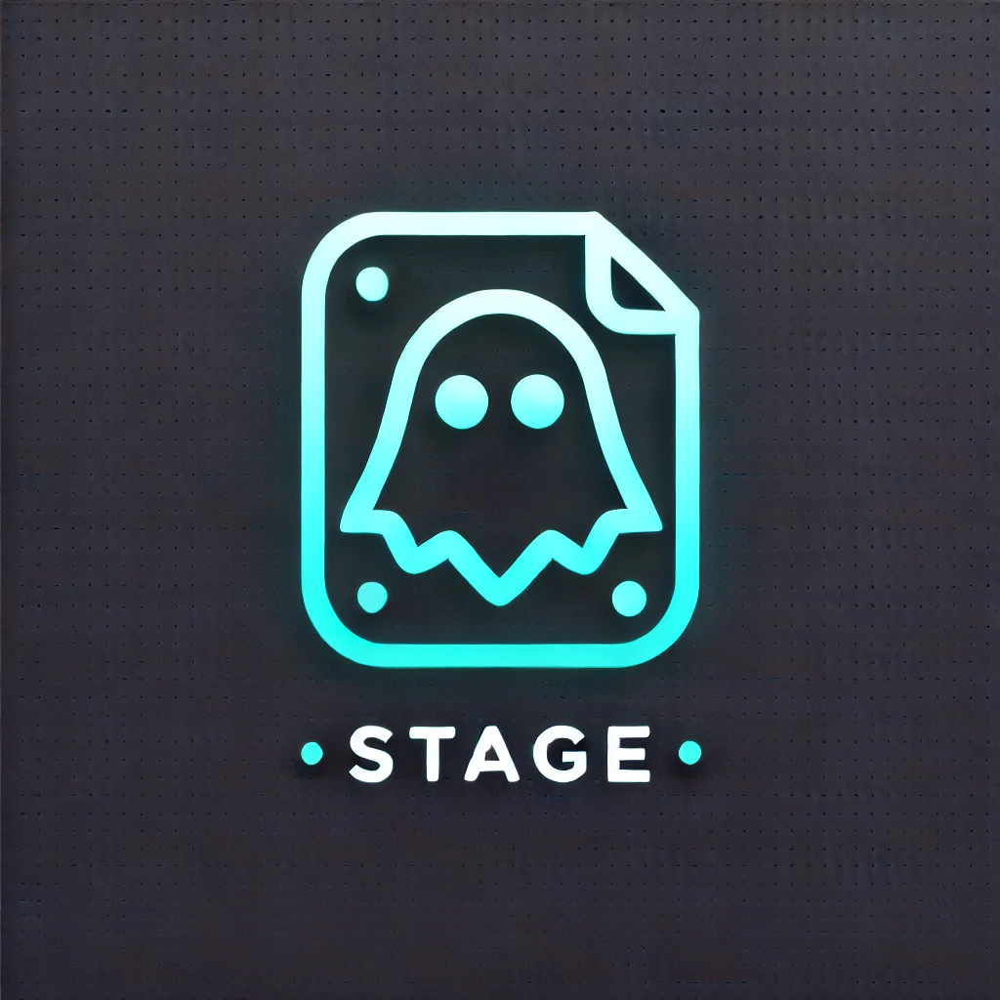

# 👻 Ghost Stage

🚀 **Ghost Stage** is a lightweight VS Code extension that **automatically stages new files in Git** as soon as they are created.  
No need to manually run `git add` in the terminal—just create a file, and it will instantly appear in the **staged changes** of Source Control.

## ✨ Features
- 📌 **Auto-stage new files** as soon as they are created.
- 🖥️ **Instant Git refresh**, so staged files immediately appear in VS Code's Source Control.
- 🔔 **Clear notifications** when files are staged.
- ⚡ **No setup required**, just install and go.
∏
## 🚀 How It Works
1. Install **Ghost Stage**.
2. Open a **Git-tracked project** in VS Code.
3. Create a new file.
4. The file is **automatically staged** (`git add`).
5. You will see the new file in **Source Control** (marked as **A** for "Added").

## ⚙️ Configuration
- No additional configuration needed.
- Works in all Git-enabled projects.

## 📥 Installation
1. Open **VS Code**.
2. Go to **Extensions** (`Ctrl+Shift+X`).
3. Search for **"Ghost Stage"** and click **Install**.

## 🛠️ Requirements
- **VS Code 1.85+**
- **Git installed and available in the system path** (`git --version`)

## 🤝 Contribute
Want to improve **Ghost Stage**? Open an issue or submit a PR on GitHub.

## 📝 License
MIT License